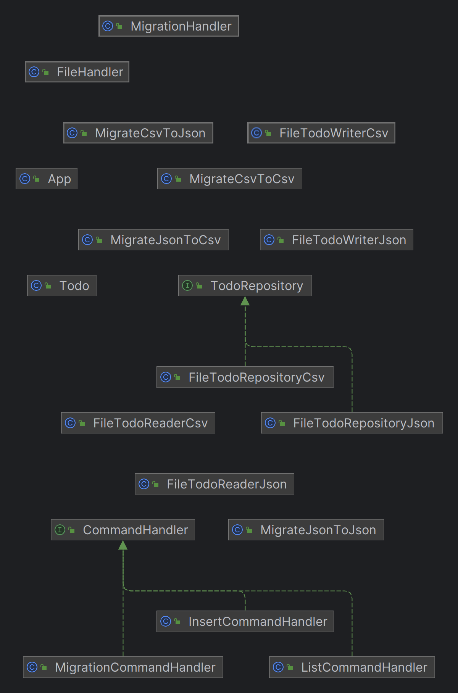

# L3 design pattern report

- **Firstname**: [Your firstname]
- **Lastname**: [Your lastname]

> Add your thoughts on every TP bellow, everything is interresting but no need to right a book.
> 
> Keep it short simple and efficient:
> 
> - What you did and why
> - What helped you and why
> - What did you find difficult
> - What did not help you
> - What did you need to change
> - Anything relevant
> 
> 
>  ANSWERS : 
> 
> - I changed the way command insert and list are handled.
     I did an interface and 2 new classes: insertCommandHandler and ListCommandHandler.
It simplify the old code (if logic) and it is easier to implement future command.
> - I asked chatgpt and a friend developer to find how would i modify the code. 
> - Understand how the code works.
> - Copy code without understanding how it work.
> - the way different commands are handle. 
> - I hate java.
> 
> 
> Add a link to schemas describing your architecture (UML or not but add a legend)
> 
> Remember: it is ok to make mistakes, you will have time to spot them later.
> 
> Fill free to contact me if needed.

    CommandHandler.java: Interface defining the contract for handling different commands in the application.

    FileHandler.java: Class responsible for handling files, including migration and supporting CSV files.

    FileTodoReaderCsv.java: Reads TODO items from CSV files.

    FileTodoReaderJson.java: Reads TODO items from JSON files.

    FileTodoRepositoryCsv.java: Implements a TODO repository that stores items in CSV format.

    FileTodoRepositoryJson.java: Implements a TODO repository that stores items in JSON format.

    FileTodoWriterCsv.java: Writes TODO items to CSV files.

    FileTodoWriterJson.java: Writes TODO items to JSON files.

    InsertCommandHandler.java: Handles the "insert" command, adding TODO items to the repository.

    ListCommandHandler.java: Handles the "list" command, listing TODO items from the repository.

    MigrateCsvToCsv.java: Handles migration from CSV to CSV format.

    MigrateCsvToJson.java: Handles migration from CSV to JSON format.

    MigrateJsonToCsv.java: Handles migration from JSON to CSV format.

    MigrateJsonToJson.java: Handles migration from JSON to JSON format.

    MigrationCommandHandler.java: Handles migration commands and file handling logic.

    MigrationHandler.java: Contains logic for performing migrations between different file formats.

    Todo.java: Represents a single TODO item with content and completion status.

    TodoRepository.java: Interface defining operations for managing TODO items.

---
...
